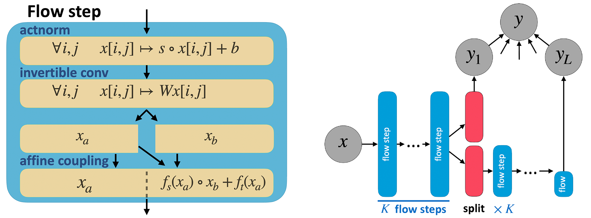
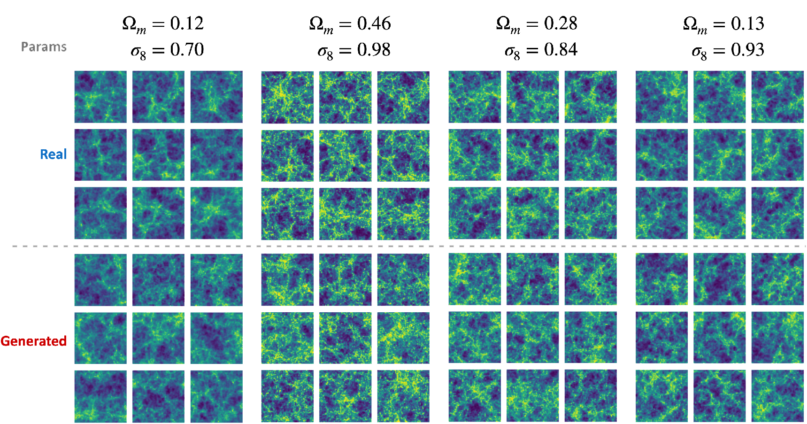

[](https://arxiv.org/abs/2211.12724)


# Conditional Glow for HI Map Generation
> This work was completed as part of the [Flatiron Institute](https://www.simonsfoundation.org/flatiron/) 2022 [MLxScience Summer School](https://www.simonsfoundation.org/grant/2022-flatiron-machine-learning-x-science-summer-school/)

This repository contains the implementation of a conditional [Glow](https://d4mucfpksywv.cloudfront.net/research-covers/glow/paper/glow.pdf) (cGlow) used in order to model neutral hydrogen (HI) maps. The implementation itself relies quite heavily on the code from https://github.com/rosinality/glow-pytorch.

The data used to fit the model in this project were maps from the [CAMELS simulation project](https://www.camel-simulations.org/), which simulates galaxy formation through the use of 6 parameters: 2 cosmological and 4 astrophysical. For this work, we were interested in learning a generative model for these HI maps conditional on the two cosmological parameters, called $\Omega\_m$ and $\sigma_8$.

While primarily focused on HI maps, the code in this repository can be used for any task where a cGlow model, conditioned on few parameters, is needed.

# cGlow Construction
The goal in this work was double: to be able to generate new HI maps and to have the capability of parameter inference, together in the same model. [Normalizing flows](https://arxiv.org/pdf/1912.02762.pdf), such as Glow, are perfect for this task as they allow for generation as well as exact likelihood estimation.

### Glow Architecture
The standard [Glow](https://d4mucfpksywv.cloudfront.net/research-covers/glow/paper/glow.pdf) architecture can be summarized by the following schematic:



Where, for all $i$, the prior of the latent variables is defined as $y_i\sim\mathcal{N}\left(0,I\right)$.

Glow is mainly constructed by 3 types of layers:
* **Actnorm**: a channel-wise affine transformation
* **Invertible convolutions**: the core of Glow is the addition of invertible convolutions with 1x1 spatial resolution kernels. These layers mix the information in the channel dimension, while also allowing some scaling
* **Affine coupling**: the affine coupling layer is the main workhorse of the model. In Glow, the affine coupling is a neural network that uses half of the channels in order to define an affine transformation over the remaining channels

These layers are then stacked into a flow step (as seen in the image above, left) and these flow steps are then stacked $K$ times in each flow block. To make training easier, Glow uses a multiscale approach - after each flow block, the output is split in two (through the channel dimension). One half goes to a new flow block, and the other to a level-specific prior.

As defined, the 3 layers are invertible, which allows for training of the model using standard MLE through the use of the change of variable identity. Let $p_y(y)=\mathcal{N}\left(0, I\right)$ and $x=f^{-1}\_\theta(y)$ where the function $f\_\theta(\cdot)$ is invertible. Then, given a dataset of $x$ s, the MLE is:

$$p\_x(x)=p\_y\left(f\_\theta(x)\right)\cdot |\text{det}\frac{\partial f\_\theta(x)}{\partial x}|\longrightarrow \hat{\theta}=\arg \min\_\theta \\{-\log p\_x(x)\\}$$

### Making Glow Conditional
Given a set of parameters $z$, we can make a normalizing flow model conditional by changing the transformation function $f\_\theta(\cdot)$:

$$p\_x(x|z)=p\_y\left(f\_\theta(x,z)\right)\cdot |\text{det}\frac{\partial f\_\theta(x,z)}{\partial x}|$$

In practice, the way to do this is by changing the layers inside Glow so that they receive $z$ as an input as well. Our approach was similar to that of [SRFlow](https://arxiv.org/pdf/2006.14200v2.pdf),  with a few modifications. By changing the actnorm layer and the affine coupling layers into conditional versions, we allow for conditional information to enter the normalizing flow, as seen below:


Essentially, a learnable affine transformation is learned with $z$ as it's input instead of actorm, and in affine coupling the learned function receives $z$ as an additional input.  Changing the architecture in this way makes it possible to learn a parameterized function of the conditional variables.

---
# HIGlow Model
**HIGlow** is a conditional Glow model trained on the CAMELS simulation data. Below are examples for generated samples conditional on the cosmological parameters defined in the data:



As can be seen, HIGlow is able to generate maps that are very similar to the real data from the CAMELS simulation, even when conditioning on specific parameter values. 

### Model Evaluation
To quantify this more explicitly, we can look at the mean power spectrum and its standard deviation using generated data versus training data:


On the left, images from the marginal $p\_x(x)$ were generated and compared to the training images and [HIFlow](https://arxiv.org/pdf/2110.02983.pdf) (another method using normalizing flows for the same purpose). HIGlow does a good job of accurately capturing the mean statistics of the original HI maps. On the right, images were generated from the conditional $p\_x(x|z)$ and compared to the training images. Here, again, HIGlow follows the statistics of the CAMELS data.

### Parameter Inference
When the distribution of the true conditional parameters $z$ is known, it can be used in order to infer the parameters given a new data sample using Bayes' law:

$$p\_x(z|x)=\frac{p\_x(x|z)p(z)}{\intop p\_x(x|z)p(z)dz}\approx\frac{p\_x(x|z_i)p(z_i)}{\sum_ip\_x(x|z_i)p(z_i)}$$

where $z_i\sim p(z)$ are samples from the distribution of parameters.

For HIGlow, $p(z)$ is a uniform distribution, which further simplifies the inference process:


Above, the red cross indicates the true parameter value while the contour lines indicate the distribution $p\_x(z|x)$ learned by HIGlow. In all cases, the true parameter value are close to the mode of the posterior distribution.

# Citations
```
@article{kingma2018glow,
  title={Glow: Generative flow with invertible 1x1 convolutions},
  author={Kingma, Durk P and Dhariwal, Prafulla},
  journal={Advances in neural information processing systems},
  volume={31},
  year={2018}
}
```

```
@inproceedings{lugmayr2020srflow,
  title={Srflow: Learning the super-resolution space with normalizing flow},
  author={Lugmayr, Andreas and Danelljan, Martin and Gool, Luc Van and Timofte, Radu},
  booktitle={European conference on computer vision},
  pages={715--732},
  year={2020},
  organization={Springer}
}
```

```
@article{villaescusa2021camels,
  title={The CAMELS Project: Cosmology and Astrophysics with Machine-learning Simulations},
  author={Villaescusa-Navarro, Francisco and Angl{\'e}s-Alc{\'a}zar, Daniel and Genel, Shy and Spergel, David N and Somerville, Rachel S and Dave, Romeel and Pillepich, Annalisa and Hernquist, Lars and Nelson, Dylan and Torrey, Paul and others},
  journal={The Astrophysical Journal},
  volume={915},
  number={1},
  pages={71},
  year={2021},
  publisher={IOP Publishing}
}
```

```
@article{hassan2021hiflow,
  title={HIFlow: Generating Diverse HI Maps Conditioned on Cosmology using Normalizing Flow},
  author={Hassan, Sultan and Villaescusa-Navarro, Francisco and Wandelt, Benjamin and Spergel, David N and Angl{\'e}s-Alc{\'a}zar, Daniel and Genel, Shy and Cranmer, Miles and Bryan, Greg L and Dav{\'e}, Romeel and Somerville, Rachel S and others},
  journal={arXiv preprint arXiv:2110.02983},
  year={2021}
}
```
