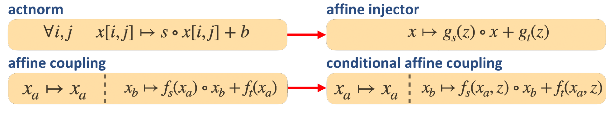

# Conditional Glow for HI Map Generation
This repository contains the implementation of a conditional [Glow](https://d4mucfpksywv.cloudfront.net/research-covers/glow/paper/glow.pdf) (cGlow) used in order to model neutral hydrogen (HI) maps. The implementation itself relies quite heavily on the code from https://github.com/rosinality/glow-pytorch.

The data used to fit the model in this project were maps from the [CAMELS simulation project](https://www.camel-simulations.org/), which simulates galaxy formation through the use of 6 parameters: 2 cosmological and 4 astrophysical. For this work, we were interested in learning a generative model for these HI maps conditional on the two cosmological parameters, called $\Omega\_m$ and $\sigma_8$.

While primarily focused on HI maps, the code in this repository can be used for any task where a cGlow model, conditioned on few parameters, is needed.

## cGlow Construction
The goal in this work was double: to be able to generate new HI maps and to have the capability of parameter inference, together in the same model. [Normalizing flows](https://arxiv.org/pdf/1912.02762.pdf), such as Glow, are perfect for this task as they allow for generation as well as exact likelihood estimation.

### Glow Architecture
The standard [Glow](https://d4mucfpksywv.cloudfront.net/research-covers/glow/paper/glow.pdf) architecture can be summarized by the following schematic:

Where, for all $i$, the prior of the latent variables is defined as $y_i\sim\mathcal{N}\left(0,I\right)$.

Glow is mainly constructed by 3 types of layers:
* **Actnorm**: a channel-wise affine transformation
* **Invertible convolutions**: the core of Glow is the addition of invertible convolutions with 1x1 spatial resolution kernels. These layers mix the information in the channel dimension, while also allowing some scaling
* **Affine coupling**: the affine coupling layer is the main workhorse of the model. In Glow, the affine coupling is a neural network that uses half of the channels in order to define an affine transformation over the remaining channels

These layers are then stacked into a flow step (as seen in the image above, left) and these flow steps are then stacked $K$ times in each flow block. To make training easier, Glow uses a multiscale approach - after each flow block, the output is split in two (through the channel dimension). One half goes to a new flow block, and the other to a level-specific prior.

As defined, the 3 layers are invertible, which allows for training of the model using standard MLE through the use of the change of variable identity. Let $p_y(y)=\mathcal{N}\left(0, I\right)$ and $x=f^{-1}\_\theta(y)$ where the function $f\_\theta(\cdot)$ is invertible. Then, given a dataset of $x$ s, the MLE is:
$$p\_x(x)=p\_y\left(f\_\theta(x)\right)\cdot |\text{det}\frac{\partial f\_\theta(x)}{\partial x}|\longrightarrow \hat{\theta}=\arg \min\_\theta \\{-\log p\_x(x)\\}$$

### Making Glow Conditional
Given a set of parameters $z$, we can make a normalizing flow model conditional:
$$p\_x(x|z)=p\_y\left(f\_\theta(x,z)\right)\cdot |\text{det}\frac{\partial f\_\theta(x,z)}{\partial x}|$$

In practice, the way to do this is by changing the layers inside Glow so that they receive $z$ as an input as well. Our approach was similar to that of [SRFlow](https://arxiv.org/pdf/2006.14200v2.pdf),  with a few modifications. By changing the actnorm layer and the affine coupling layers into conditional versions, we allow for conditional information to enter the normalizing flow, as seen below:

